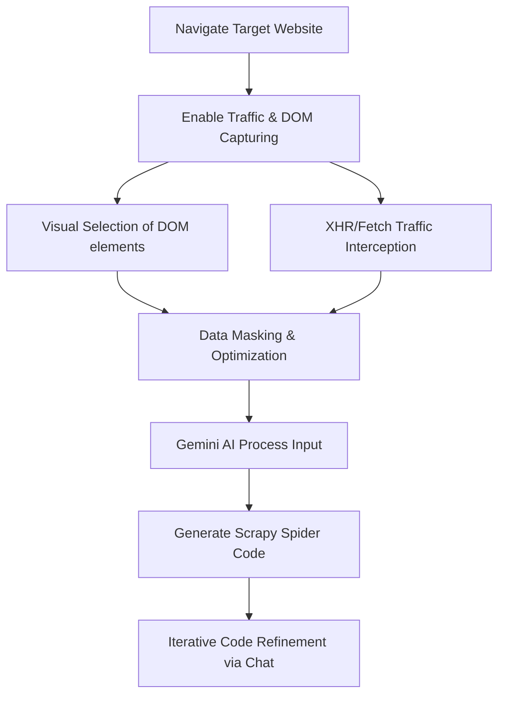

# Chrome Extension Scraping Agent

[](LICENSE)
[](manifest.json)
[](tsconfig.json)
[](#how-it-works)
[](README_TR.md)

AI-powered Chrome developer tool that records DOM interactions and XHR/Fetch network traffic to generate production-ready Scrapy spiders automatically using Google Gemini.

[Key Features](#features) • [Installation](#installation) • [How It Works](#how-it-works) • [Architecture](#architecture) • [Roadmap](#roadmap) • [Security](#security-notice)

---

## Turn Browser Activity into Production-Ready Spiders

Writing web scraping spiders manually is slow, error-prone, and painful to maintain when sites rely heavily on dynamic Single Page Applications (SPAs) or complex XHR/Fetch API calls.

This extension observes:
* **DOM Interactions:** Vetted HTML elements, structures, and CSS selectors.
* **Network Traffic:** Background XHR/Fetch requests and response payloads.
* **Dynamic Behaviors:** Changes triggered by clicks, scroll events, or infinite load.

Then uses **Gemini AI** to write fully structured, optimized Python Scrapy code in seconds.

---

## Screenshots & Demo

| 🌐 Live Interception & UI | 🤖 Gemini Code Generation & Refinement Chat |
|:---:|:---:|
|  |  |
| *Interactive HTML element selection & live request tracking* | *Reviewing, copying, and dynamically updating generated Scrapy spiders* |

> [!TIP]
> **Pro-tip for Repository Owners:** Replace the placeholder images above with high-quality animated GIFs showing the extension in action. A short GIF demonstrating element selection and spider generation increases developer engagement by over 200%.

---

## Features

### 🔍 Network Traffic Inspection
Intercept and capture XHR/Fetch API requests directly from the active tab. Analyze response structures automatically to build API-based spiders that bypass heavy HTML parsing.

### 🎯 Interactive DOM Element Selector
Visually select and label the exact HTML elements you want to scrape. The extension cleans up unnecessary styles, SVGs, and script tags on the fly to **reduce Gemini API token usage by up to 70%**.

### ⚡ AI-Powered Spider Generation
Generate optimized Python Scrapy spider classes automatically. Simply define your target elements and prompt Gemini to draft the crawling logic.

### 💬 Iterative AI Refinement Chat
Refine and update generated code dynamically without leaving the browser tab. Use natural language to ask Gemini for pagination handling, authentication payloads, custom pipelines, or error-resilient selectors.

---

## How It Works



1. **Navigate & Open:** Start the target website and open the extension panel overlay.
2. **Interact & Record:** Click/select key elements visually and run search or filters to trigger network requests.
3. **Automatic Masking:** The background script automatically strips sensitive headers (e.g., `Cookie`, `Authorization`) to ensure data privacy.
4. **Token Savings:** SVG paths, inline styles, and external script nodes are stripped to minimize payload size.
5. **AI Synthesis:** The structured DOM nodes and API request JSONs are packaged and sent to Gemini.
6. **Deploy & Refine:** Copy the production-ready Python script or instruct the agent through the embedded chat interface to tweak selector criteria.

---

## Architecture

The project is built on **Vite**, **TypeScript**, and **React**, compiled into a Manifest V3 compliant bundle.

```
chrome_extension_scraping/
├── manifest.json         # Extension manifest (MV3 configuration)
├── package.json          # Dependency scripts & build pipelines
├── popup.html            # UI entry point for popup trigger
├── settings.html         # UI entry point for settings & API configuration
├── vite.config.ui.ts     # Bundling pipeline configurations for UI views
├── src/                  # Developer source codes
│   ├── background/       # Service worker handling secure Gemini APIs
│   ├── content/          # Content script managing DOM selectors
│   ├── inject/           # Main world hook to intercept page-level fetch/XHR requests
│   ├── popup/            # Extension panel React application
│   ├── options/          # Extension Settings React application
│   └── types/            # TypeScript type definitions
└── icons/                # Extension brand assets
```

### Components Functionality
* **`inject.js`:** Runs in the page context (`MAIN` world) to hook into `window.fetch` and `XMLHttpRequest` and capture background network traffic.
* **`content.js`:** Manages page-level communications, rendering the selection highlight overlays, and transmitting visual data to the popup panel.
* **`background.ts`:** Acts as the extension's service worker, handling storage persistence and proxying requests securely to Google's API to bypass CORS/CSP constraints.
* **`popup/` & `options/`:** Modular React components styling the dark-themed user interface, managing active selector states, and rendering the code editor/chat view.

---

## Requirements

* **Google Chrome** (or Chromium-based browser like Brave, Edge, Opera)
* **Google Gemini API Key** (Get a free or paid API key at [Google AI Studio](https://aistudio.google.com/))

---

## Installation

### 1. Build from Source
First, clone this repository to your machine and compile the extension:
```bash
# Clone the repository
git clone https://github.com/yourusername/scrapy-copilot.git
cd scrapy-copilot

# Install developer dependencies
npm install

# Compile the extension, copy assets, and package as CRX + ZIP
npm run build
```

This compiles the source code to `/dist`, generates a packaged Chrome extension (`dist.crx` signed with `dist.pem`), and packages a portable archive (`otonom-scrapy-ajani.zip`) automatically.

### 2. Load into Chrome
You can install the extension in Chrome using either of these methods:

#### Method A: Load unpacked (Recommended for development)
1. Open Google Chrome and navigate to `chrome://extensions/`.
2. Enable **Developer mode** in the top-right corner.
3. Click **Load unpacked** in the top-left corner.
4. Select the compiled **`dist`** folder inside the project.

#### Method B: Load CRX package
1. Drag and drop the generated **`dist.crx`** file directly into the `chrome://extensions/` tab.
2. Confirm the installation prompts.

---

## Use Cases

* **SPA Web Scraping:** Scrape data from heavily dynamic React/Angular/Vue web applications.
* **API Reverse Engineering:** Extract endpoint URLs, post parameters, and structured JSON structures without manual devtools inspect.
* **Authenticated Crawling:** Re-create request mechanisms for pages behind login steps (while keeping credentials secure).
* **Rapid Scrapy Prototyping:** Skip writing boilerplate Scrapy code and generate starter spider classes instantly.
* **Learning Tool:** Observe how network queries map directly to Scrapy request flows.

---

## Roadmap

- [ ] **HAR File Export Support** - Record entire browse flows and export directly to `.har` sessions.
- [ ] **Playwright & Selenium Integrations** - Generate Playwright and Selenium crawler code alongside Scrapy.
- [ ] **Multi-Model Support** - Options to choose between Gemini 2.5 Flash, Gemini 1.5 Pro, or custom endpoint models.
- [ ] **Scrapy Scaffolding Exporter** - Package spiders into fully functional multi-file Scrapy boilerplates automatically.
- [ ] **Dynamic Replay Engine** - Re-execute recorded XHR request patterns straight from the extension panel to debug target behaviors.

---

## Security Notice

> [!WARNING]
> Captured network requests may contain authorization tokens, personal identifying information, or API secrets. While Scrapy Copilot automatically masks common security fields (e.g. `Cookie` and `Authorization` headers) before sending them to the Gemini API, **never share exported sessions publicly or feed unverified third-party data through the AI.**

---

## Contributing

We welcome contributions from the community! Please read our [Contributing Guide](CONTRIBUTING.md) to understand branch conventions, commit message structures, and details about submitting PRs.

---

## License

This project is licensed under the MIT License - see the [LICENSE](LICENSE) file for details.
